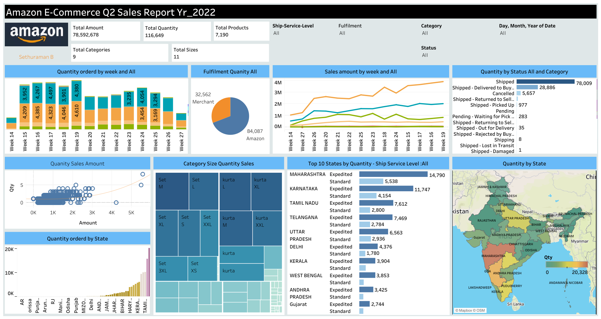

# E-Commerce-Amazon-Sales-Dashboard
This repository provides a comprehensive Amazon sales dashboard for e-commerce businesses. It offers interactive visualizations and analytics to track and analyze sales performance, product trends, and customer behavior on the Amazon platform.

📊 Dashboard Overview

The dashboard provides a comprehensive view of:

💰 Total Sales Amount: 78.5M
📦 Total Quantity Sold: 116K+
🛍️ Total Products: 7,190

🎯 Key Business Insights

📈 Sales Trends
Sales show a consistent upward trend across weeks
Peak sales observed around Week 19
Strong correlation between quantity sold and revenue

🚚 Fulfillment Analysis

Amazon fulfillment dominates (~72%)
Merchant fulfillment contributes ~28%
Indicates strong logistics efficiency from Amazon

📦 Order Status Insights

The majority of orders are successfully shipped (78K+)
Notable:
Returned items: ~28K
Cancelled orders: ~5.6K
Highlights the return management opportunity

🧥 Product Category Insights

Top-performing products: Sets & Kurtas
Sizes M, L, and XL dominate sales
Inventory planning should prioritize these combinations

🌍 Regional Performance

Top performing states:

Maharashtra
Karnataka
Tamil Nadu
Telangana

Insights:

Metro & Tier-1 cities drive the majority of sales
South India shows strong demand concentration

⚡ Shipping Performance

Expedited shipping significantly higher than standard
Indicates customer preference for faster delivery

📌 Visualizations Included
📊 Weekly Sales Trend (Line Chart)
📦 Quantity by Status (Bar Chart)
🧩 Category & Size Treemap
🗺️ State-wise Sales Distribution Map
📉 Quantity vs Sales Scatter Plot
🚚 Fulfillment Split (Pie Chart)
🏆 Top States by Shipping Type

🛠️ Tools & Technologies
Tableau (Dashboard Visualization)
Excel / CSV (Data Source)
Data Cleaning & Transformation

💡 Business Recommendations

🔄 Reduce return rates via better product descriptions & QC
🚀 Expand expedited shipping for high-demand regions
📦 Optimize inventory for top-selling sizes (M, L, XL)
🌍 Focus marketing on high-performing states
❌ Investigate cancellation reasons to improve conversion
📸 Dashboard Preview

⭐ If you found this useful

Give this repo a ⭐ and share your feedback!
